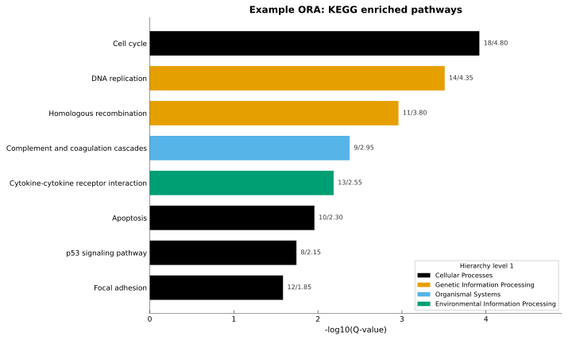
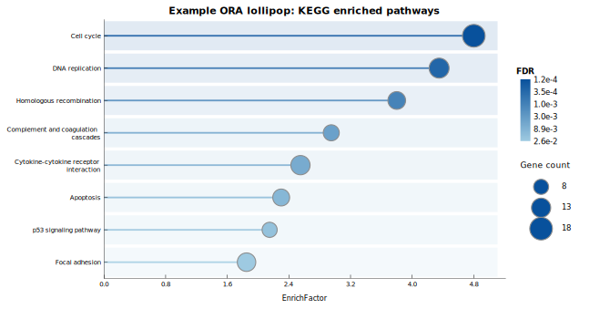
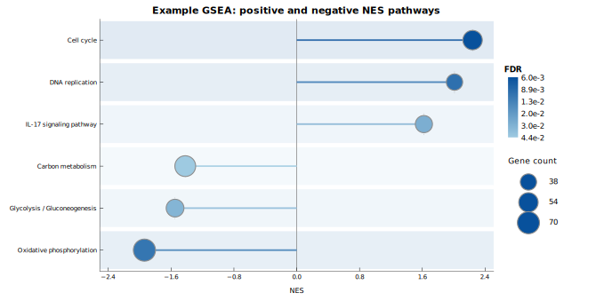
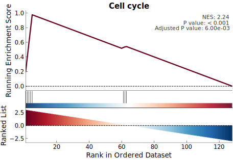
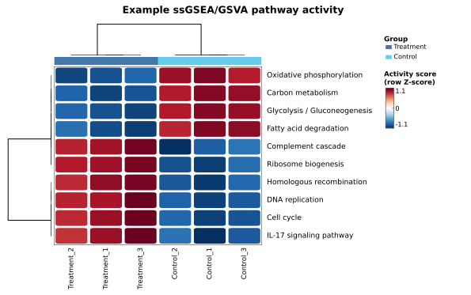
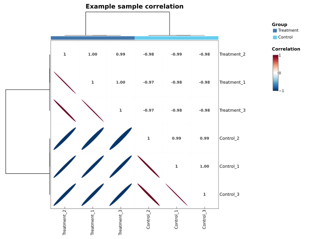
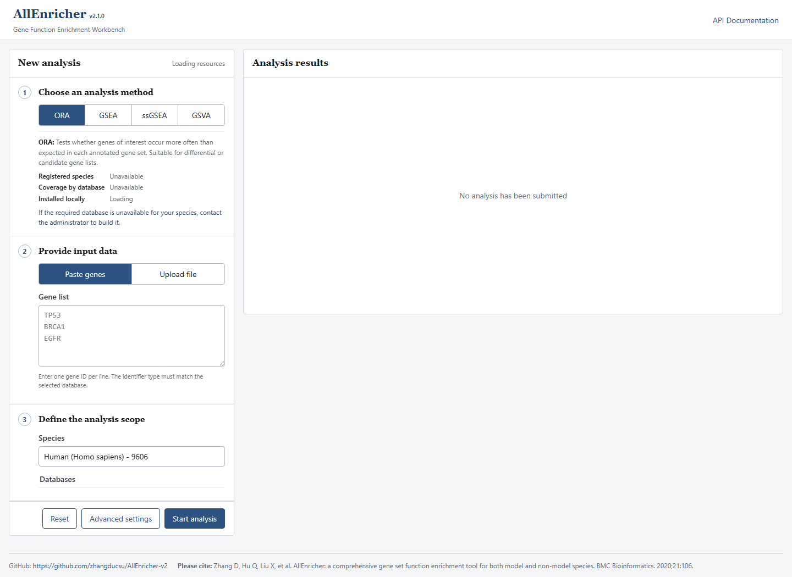
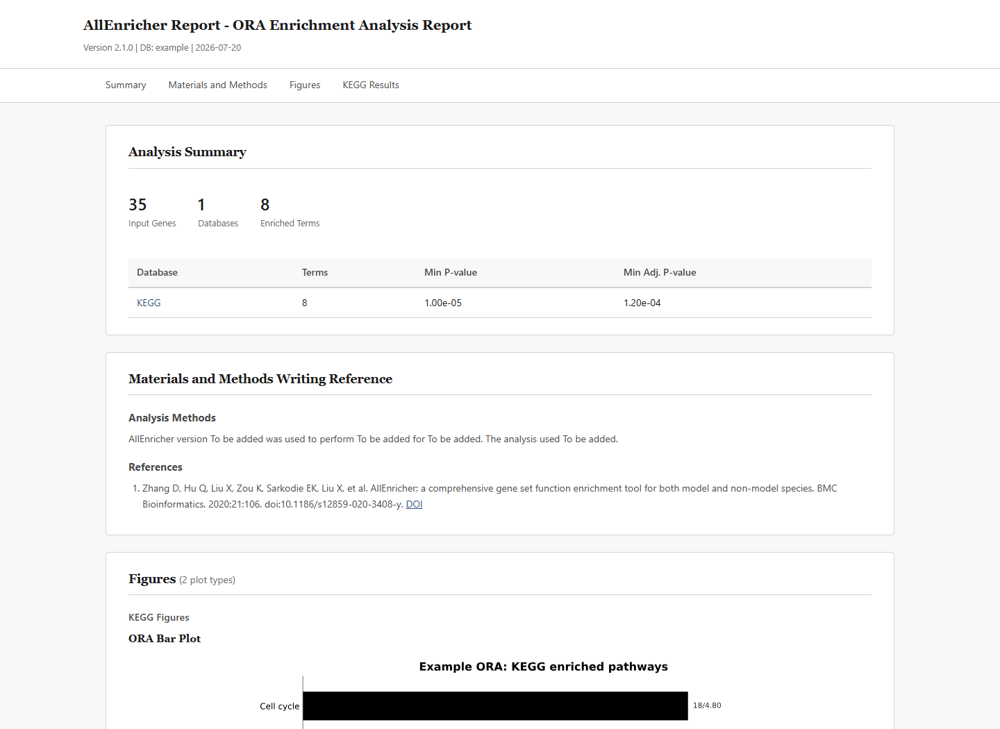

# AllEnricher v2

AllEnricher is a multi-species enrichment analysis workbench for researchers who
need one consistent path from gene lists, ranked genes, or expression matrices to
auditable result tables, publication-oriented figures, HTML reports, REST API
jobs, and evidence-linked AI interpretation.

[](https://www.python.org/)
[](LICENSE)


## What You Can Do

| Input you have | Recommended analysis | Typical output |
| --- | --- | --- |
| A candidate or differential gene list | ORA | Enriched terms, hit genes, rich factors, bar and lollipop figures |
| A signed ranked gene table | GSEA | fgsea-compatible tables, enrichment curves, NES summaries, leading-edge genes |
| A gene-by-sample expression matrix | ssGSEA or GSVA | Activity matrices, grouped heatmaps, sample correlation, group-difference plots |
| TF-focused biological questions | TRRUST, ChEA3, AnimalTFDB or hTFtarget | TF enrichment tables and TF gene-set figures |
| A non-standard species or private annotation | Custom database build | Reusable local gene-set database with hierarchy-aware outputs |

All user-facing outputs preserve term IDs and descriptive names. When hierarchy
annotations are available, result tables and ORA figures keep the hierarchy
string, for example `Metabolism|Amino acid metabolism|Arginine biosynthesis`.

## Choose Your Entry Point

| Use case | Start here |
| --- | --- |
| Interactive local analysis | `allenricher serve --host 127.0.0.1 --port 8000` |
| Scripted analysis and batch runs | `allenricher analyze ...` |
| Database preparation and species support | `allenricher download`, `allenricher build`, `allenricher list-species` |
| Update checks and database housekeeping | `allenricher check-update`, `allenricher list-versions`, `allenricher cleanup` |
| Programmatic integration | REST API at `/api/analyze`, `/api/results/{job_id}`, and `/api/results/{job_id}/report` |

The CLI exposes 12 subcommands:

| Command | Purpose |
| --- | --- |
| `analyze` | Run ORA, GSEA, ssGSEA, or GSVA with tables, figures, HTML reports, and optional AI interpretation. |
| `download` | Download shared source files and TF resources into a local database directory. |
| `build` | Build species-specific analysis databases from downloaded sources or user annotations. |
| `serve` | Start the local REST API and Web workbench. |
| `list` | Quickly list bundled species or public database names. |
| `config` | Write a starter YAML configuration file. |
| `check-update` | Check whether remote source data are newer than local snapshots. |
| `cleanup` | Remove old database snapshots after a dry-run review. |
| `list-versions` | Inspect installed database versions and build lineage. |
| `list-species` | Query the unified TaxID-centered species registry. |
| `query-species` | Look up one species by TaxID, Latin name, or KEGG organism code. |
| `tf-enrich` | Dedicated TF ORA/GSEA entry point retained for TF-focused workflows. |

## Why v2

- One CLI/API/Web path for ORA, GSEA, ssGSEA, and GSVA.
- TaxID-centered species registry covering 42,124 species in the packaged registry.
- GO, KEGG, Reactome, WikiPathways, disease, TF, and custom gene-set databases.
- Publication-oriented figures with method-aware color palettes.
- Self-contained HTML reports with figures, searchable tables, provenance,
  Materials and Methods text, and AI evidence links.
- Optional AI interpretation that cites concrete result rows rather than free
  text guesses.

## Documentation Status

This README is the user-facing entry point for the current v2 implementation.
The maintained implementation matrix is in
[`docs/CURRENT_IMPLEMENTATION.md`](docs/CURRENT_IMPLEMENTATION.md). Historical planning notes and generated audit outputs are intentionally excluded from the main repository; release checks live under `docs/release`.

## Supported Databases and Species Coverage

AllEnricher v2 is TaxID-centered. The packaged species registry currently lists
**42,124 species** and lets the CLI, REST API, and Web workbench show which
databases are available for each species. Recompute these counts at any time
with:

```bash
allenricher list-species --summary
```

Database availability still depends on the files installed in the selected
database directory. Use `allenricher list-species`, `allenricher query-species`,
`allenricher list-versions`, or the Web workbench to inspect local support.

| Database | Supported species in registry | Content | Notes |
| --- | ---: | --- | --- |
| GO | 32,443 | Gene Ontology annotations | Broadest functional-annotation coverage. |
| KEGG | 10,871 | KEGG pathways | KEGG organism-code based pathway support. |
| Reactome | 16 | Curated Reactome pathways | Model-organism pathway coverage. |
| WikiPathways | 18 | Community-curated pathway gene sets | Versioned GMT/GPML source support. |
| DO | 1 | Disease Ontology associations | Human disease enrichment. |
| DisGeNET (`v20190612`) | 1 | Disease-gene associations from the retained free snapshot | Human; retained free release snapshot. |
| TRRUST v2 | 2 | Curated TF-target regulatory interactions | Human and mouse. |
| ChEA3 | 1 | TF-target gene-set libraries | Human. |
| AnimalTFDB | 182 | Animal TF annotations with ortholog-mapped target sets | AnimalTFDB species with prepared local files. |
| hTFtarget | 1 | Tissue-specific TF-target associations | Human. |
| CUSTOM | user-defined | User-built gene sets | Any species with user-provided annotations. |

DisGeNET is not downloaded from current DisGeNET releases because later data are
not freely downloadable through the same public route. AllEnricher v2 labels the retained free snapshot as `v20190612` in user-facing output.

## Analysis Methods

| Method | Required input | Default gene-set size after gene intersection |
| --- | --- | --- |
| ORA (`hypergeometric`) | Query gene list | 3 to unbounded |
| GSEA (`gsea`) | Ranked genes with signed numeric weights | 15 to 500 |
| TF GSEA | Ranked genes with signed numeric weights | 15 to 5,000 |
| ssGSEA (`ssgsea`) | Gene-by-sample expression matrix | 1 to unbounded |
| GSVA (`gsva`) | Gene-by-sample expression matrix | 1 to unbounded |

Gene-set size filters are applied after intersecting database gene sets with the
genes available to the selected method. Users can override these defaults
through CLI options or a YAML/JSON configuration file.

## Installation

```bash
git clone https://github.com/zhangducsu/AllEnricher-v2.git
cd AllEnricher-v2
python -m pip install -e ".[visualization,api]"
```

Optional extras:

```bash
python -m pip install -e ".[ai]"   # AI client libraries
python -m pip install -e ".[dev]"  # pytest and development checks
```

## R Dependencies

GSEA, ssGSEA, and GSVA require a working `Rscript` installation with
Bioconductor packages `fgsea` and `GSVA`.

```r
if (!requireNamespace("BiocManager", quietly = TRUE)) {
  install.packages("BiocManager")
}
BiocManager::install(c("fgsea", "GSVA"), ask = FALSE, update = FALSE)
```

R publication figures use `ggplot2`, `dplyr`, `tidyr`, and `scales`. The R
pathway-network figure additionally requires `aPEAR` and its dependencies. Check
the current R script requirements with:

```bash
python test_e2e_2026/18_real_world_sci/verify_r_dependencies.py
```

## Input Formats

### ORA Gene List

Plain text with one gene ID per line and no header:

```text
TP53
BRCA1
EGFR
```

### GSEA Ranked Gene Table

TSV or CSV with `gene` and numeric `weight` columns. Weights should be signed
and should normally include both positive and negative values.

```text
gene	weight
STAT1	4.82
IRF7	3.91
MYC	-2.74
```

The Web workbench can also convert an existing differential-results table into
this two-column format after the user selects the gene and ranking-statistic
columns. AllEnricher does not perform upstream differential-expression analysis.

### Expression Matrix

TSV or CSV with gene IDs in the first column, sample names in the header, and
numeric values in all remaining cells:

```text
gene	Control_1	Control_2	Treatment_1	Treatment_2
TP53	8.2	7.9	10.4	10.1
BRCA1	5.1	5.3	4.8	4.9
```

Sample groups can be supplied as:

```text
Control:Control_1,Control_2;Treatment:Treatment_1,Treatment_2
```

The Web workbench reads sample names from the matrix and provides an interactive
group editor, so users do not need to prepare this string manually.

### GMT Gene Sets

Each tab-delimited row contains a gene-set ID, a description, and one or more
genes:

```text
SET_001	Cell-cycle genes	CDK1	CCNB1	CDC20
```

## Database Download and Version Management

Download shared source files into a database directory:

```bash
allenricher download \
  --databases GO,KEGG,Reactome,DO,WikiPathways \
  --species hsa \
  --database-dir ./database
```

Before a managed shared-source download starts, AllEnricher checks local version
metadata against remote source metadata where that check is implemented. If the
local snapshot is already current, the command exits without replacing files.
Use `--force` when you intentionally want to refresh an existing local snapshot.
If remote update checking itself fails, the downloader warns and continues with
the requested download instead of silently reporting success.

Useful download options:

| Option | Behavior |
| --- | --- |
| `--workers N` | Use up to `N` parallel workers for multi-file downloads. |
| `--no-multi-thread` | Run downloads sequentially, useful for unstable networks or debugging. |
| `--no-verify` | Skip post-download integrity checks. Use only when you have independent file validation. |
| `--force` | Re-download even when the local version check says the snapshot is current. |
| `--database-dir DIR` | Keep all source files, versions, registries, and built databases under `DIR`. |

Download TF source data:

```bash
allenricher download -d TRRUST --database-dir ./database
allenricher download -d ChEA3 --database-dir ./database
allenricher download -d AnimalTFDB --species Bos_taurus,Sus_scrofa --database-dir ./database
```

Alternative TF download selectors:

```bash
allenricher download -d TF --trrust --database-dir ./database
allenricher download -d TF --chea3 --database-dir ./database
allenricher download -d TF --animaltfdb --species Bos_taurus --database-dir ./database
```

AnimalTFDB species names use the official underscore Latin-name form, for
example `Bos_taurus` or `Sus_scrofa`. When no AnimalTFDB species is supplied,
the command refreshes TF registry coverage and downloads the human hTFtarget
library.

Inspect and maintain local versions:

```bash
allenricher check-update --database-dir ./database
allenricher check-update --database-dir ./database --json
allenricher list-versions --database-dir ./database
allenricher list-versions --database-dir ./database --json
allenricher list-versions --database-dir ./database --lineage
allenricher cleanup --database-dir ./database --dry-run --keep 2
```

Version-management details:

| Command | What it checks or changes |
| --- | --- |
| `check-update` | Non-destructive remote/local comparison. `--json` appends machine-readable status for automation. |
| `list-versions` | Installed snapshot summary. `--lineage` prints build provenance when it is recorded. |
| `cleanup --dry-run --keep N` | Shows which older snapshots would be removed while retaining the newest `N`. |
| `cleanup --keep N` | Actually removes stale snapshots from the selected `--database-dir`. Review dry-run output first. |

`cleanup` can delete old database snapshots when `--dry-run` is omitted. Review
its preview before running a real cleanup.

## Building Species Databases

After downloading shared sources, build analysis-ready database artifacts for a
species. TaxID is the stable species identity; KEGG code is a convenient alias
when available.

```bash
allenricher build \
  --species hsa \
  --taxonomy 9606 \
  --databases GO,KEGG,Reactome,WikiPathways,DO,DisGeNET \
  --database-dir ./database \
  --gene-info ./database/basic/gene_info.gz \
  --latin-name Homo_sapiens
```

Build from user-provided annotations:

```bash
allenricher build \
  --species custom_species \
  --taxonomy 999999 \
  --databases custom \
  --custom-annot annotations.tsv \
  --custom-db-name CUSTOM \
  --annot-format auto \
  --hierarchy-sep "|" \
  --database-dir ./database
```

Custom GO or KEGG annotations can be supplied with `--go-annot` or
`--kegg-annot`. Annotation rows may include hierarchy text such as
`Metabolism|Amino acid metabolism|Arginine biosynthesis`; when hierarchy is
available, result tables retain it and ORA barplots can use it for category
coloring.

Build options worth knowing:

| Option | Use case |
| --- | --- |
| `--gene-info` | Supplies NCBI `gene_info.gz` for genome backgrounds, gene validation, and standard builds that need gene metadata. |
| `--taxonomy` | TaxID is the stable species identity used by the registry and Web support checks. |
| `--latin-name` | Adds a readable scientific name such as `Homo_sapiens` or `Bos_taurus`. |
| `--go-annot` / `--kegg-annot` | Build GO or KEGG-like databases from user annotation exports. |
| `--custom-annot` / `--custom-db-name` | Build a named user database from a two-, three-, or four-column annotation table. |
| `--annot-format auto` | Auto-detect supported annotation layouts; explicit choices are available for strict pipelines. |
| `--hierarchy-sep` | Defines how hierarchy levels are separated in annotation text. |

Successful TF builds and TF downloads also update the unified species registry,
so `list-species`, the REST API, and the Web workbench can report TF database
support with the same mechanism used for GO, KEGG, Reactome, DO, DisGeNET, and
WikiPathways.

## Species Registry and Database Queries

For a quick built-in resource list, use:

```bash
allenricher list species
allenricher list databases
```

List supported species from the unified registry:

```bash
allenricher list-species --summary
allenricher list-species --format table
allenricher list-species --format tsv
allenricher list-species --format json
```

Filter by database support:

```bash
allenricher list-species --go --kegg --summary
allenricher list-species --reactome --wikipathways
allenricher list-species --trrust
allenricher list-species --chea3
allenricher list-species --animaltfdb
allenricher list-species --htftarget
```

Query one species:

```bash
allenricher query-species --taxid 9606
allenricher query-species --name Homo_sapiens
allenricher query-species --kegg hsa
```

The Web workbench uses the same registry data. Unsupported databases remain
visible but disabled for the selected species, so users can see which functions
exist and which require an additional species build.

## Example Figure Gallery

The small gallery in `examples/` is generated from fixed example tables, so the
figures shown below can be reproduced without downloading public databases:

```bash
python examples/run_examples.py
```

The generated SVG files are saved under `examples/output/figures/` and are used
in the analysis sections below to show what each workflow produces.

```text
examples/
|-- data/
|   |-- ora_results.tsv
|   |-- gsea_results.tsv
|   `-- activity_scores.tsv
|-- run_examples.py
`-- output/figures/
    |-- ora_kegg_barplot.svg
    |-- ora_kegg_lollipop.svg
    |-- gsea_kegg_lollipop.svg
    |-- gsea_cell_cycle_enrichment.svg
    |-- activity_heatmap.svg
    `-- sample_correlation.svg
```

## Running Enrichment Analyses

Common analysis controls:

| Control | Applies to | Notes |
| --- | --- | --- |
| `--database-dir` | all methods | Select a non-default database root. |
| `--use-version` | all methods | Use a specific installed database snapshot instead of the latest. |
| `--config` | all methods | Load YAML/JSON defaults; explicit CLI flags take precedence. |
| `--jobs` | all methods | Parallel worker count for supported analysis steps. |
| `--only-significant` | tables/reports | Write only rows passing the configured P/Q cutoffs. |
| `--no-plot` / `--no-report` | outputs | Disable figure or HTML report generation. |
| `--methods-language en` | reports | Controls the Materials and Methods writing-reference language. |
| `--verbose` | diagnostics | Enables debug logging for troubleshooting. |

### ORA

```bash
allenricher analyze \
  --input genes.txt \
  --species hsa \
  --databases GO,KEGG \
  --method hypergeometric \
  --output results/ora
```

Example ORA figures generated from `examples/data/ora_results.tsv`:





ORA-specific controls include `--background-mode annotated|genome|custom`,
`--background measured_genes.txt`, `--correction BH|BY|bonferroni|holm|none`,
`--pvalue`, `--qvalue`, and `--min-genes`. The default ORA gene-set size policy
uses a minimum size of 3 and no maximum size.

Use a custom background only when it represents the genes that could have been
selected in the upstream experiment:

```bash
allenricher analyze \
  --input genes.txt \
  --species hsa \
  --databases GO \
  --method hypergeometric \
  --background-mode custom \
  --background measured_genes.txt \
  --output results/ora_custom_background
```

### GSEA

```bash
allenricher analyze \
  --ranked-genes ranked_genes.tsv \
  --species hsa \
  --databases GO,KEGG \
  --method gsea \
  --plot-types enrichment,enrichment2,barplot,lollipop,ridgeplot,emapplot \
  --output results/gsea
```

GSEA requires a ranked table with a gene column and a numeric weight column.
A one-column gene list is not sufficient for GSEA. Optional controls include
`--gmt` for an external GMT file, `--gsea-enrichment-top-up`,
`--gsea-enrichment-top-down`, `--gsea-multi-top-up`, and
`--gsea-multi-top-down`. The default GSEA gene-set size policy is 15-500 after
intersecting each gene set with the ranked genes; TF GSEA uses the same minimum
and a larger default maximum of 5000.

Example GSEA figures generated from `examples/data/gsea_results.tsv`:





### ssGSEA and GSVA

```bash
allenricher analyze \
  --expression-matrix expression.tsv \
  --groups "Control:Control_1,Control_2;Treatment:Treatment_1,Treatment_2" \
  --species hsa \
  --databases GO \
  --method ssgsea \
  --plot-types heatmap,group_comparison,correlation \
  --output results/ssgsea
```

Example pathway-activity figures generated from `examples/data/activity_scores.tsv`:





Replace `ssgsea` with `gsva` to run GSVA. The activity matrix keeps the
Bioconductor-compatible matrix structure. ssGSEA and GSVA use expression-matrix
intersection size filters of 1 to unbounded by default. Group-comparison figures
and statistics are generated only when usable group information is supplied.

## Transcription Factor Analysis

TF databases can be used through the regular `analyze` command by passing TF
names in `--databases`:

```bash
allenricher analyze \
  --input genes.txt \
  --species hsa \
  --databases TRRUST,ChEA3,hTFtarget \
  --method hypergeometric \
  --tf-library ARCHS4,ENCODE \
  --tf-tissue liver,blood \
  --output results/tf_ora
```

For GSEA with TF gene sets:

```bash
allenricher analyze \
  --ranked-genes ranked_genes.tsv \
  --species hsa \
  --databases TRRUST,ChEA3 \
  --method gsea \
  --tf-max-size 5000 \
  --output results/tf_gsea
```

The TF-specific `tf-enrich` entry point is available for TF ORA and TF GSEA:

```bash
allenricher tf-enrich \
  --input genes.txt \
  --species hsa \
  --database trrust \
  --method ora \
  --report \
  --output results/tf_enrich
```

TF options include `--tf-library` for ChEA3, `--tf-tissue` for hTFtarget,
`--tf-regulation` for TRRUST, `--tf-min-size`, `--tf-max-size`, and optional
`--tf-combine` consensus ranking.

## Figures and Color Controls

Default plot types:

| Method | Figure types |
| --- | --- |
| ORA | `barplot`, `lollipop` |
| GSEA | `enrichment`, `enrichment2`, `barplot`, `lollipop`, `ridgeplot`; `emapplot` when requested |
| ssGSEA / GSVA | `heatmap`, `group_comparison`, `correlation` |

GSEA, ssGSEA, and GSVA publication figures use R by default. Use
`--python-plots` only when the minimal Python fallback is explicitly desired.
The Web workbench does not expose an R/Python switch and uses the backend
default.

GSEA network plots are controlled separately with `--emapplot-qvalue`,
`--emapplot-min-count`, and `--emapplot-top-n`; the filtering order is FDR,
minimum hit count, then top-N selection. Single-pathway GSEA plots default to
top 5 positive NES and top 5 negative NES terms, while multi-pathway plots
default to top 3 positive and top 3 negative terms.

```bash
allenricher analyze ... --plot-format png --plot-dpi 300
allenricher analyze ... --style nature
allenricher analyze ... --categorical-palette okabe_ito
allenricher analyze ... --sequential-palette blues
allenricher analyze ... --diverging-palette blue_red
```

Plot themes control typography, spacing, borders, and grid density:

| Theme | Best use |
| --- | --- |
| `nature` | Default compact manuscript style. |
| `science` | Slightly stronger borders and serif-oriented publication style. |
| `presentation` | Larger fonts and heavier spacing for slides or talks. |
| `cell`, `omicshare` | Legacy aliases mapped to maintained styles for compatibility. |

Palette roles are separated so colors match the plotted data type instead of the
selected database name:

| Palette role | Used for | Available palettes |
| --- | --- | --- |
| Categorical | Groups, database hierarchy classes, discrete labels | `tol_bright`, `tol_high_contrast`, `tol_vibrant`, `tol_muted`, `tol_medium_contrast`, `tol_light`, `okabe_ito`, `nature`, `science`, `cell`, `lancet`, `nejm`, `jama`, `omicshare`, `echarts_v4` |
| Sequential | One-direction continuous values such as `-log10(FDR)` or enrichment strength | `colorbrewer_blues`, `colorbrewer_purd`, `viridis`, `cividis` |
| Diverging | Centered values with direction, such as NES, pathway activity, and correlation | `colorbrewer_rdbu`, `tol_sunset`, `colorbrewer_prgn`, `colorbrewer_brbg` |

Defaults are `nature`, `tol_bright`, `colorbrewer_blues`, and
`colorbrewer_rdbu`. The Web workbench only shows palette controls that are
relevant to the selected figure types.

## AI Interpretation

AI interpretation is optional. It is method-aware and uses structured evidence
prepared by code before any model call:

- ORA evidence includes term ID, term name, adjusted P value, EnrichFactor,
  gene count, and hit genes.
- GSEA evidence separates positive and negative NES terms and includes ES, NES,
  p value, adjusted P value, size, and leading-edge genes.
- ssGSEA/GSVA evidence summarizes pathway activity matrices, group means,
  group differences, and outlier samples when groups are available.
- TF evidence includes TF name, database source, significance, target-set size,
  matched targets, and ranking information when available.

Each selected evidence row receives a stable `evidence_id` such as `GO:R001` or
`GSEA_Reactome:R002`. HTML reports show these IDs and link them back to result
rows. AI failures are recorded separately and do not turn a completed enrichment
analysis into a failed analysis.

Available AI profiles:

| Mode | Purpose |
| --- | --- |
| `summary` | Researcher-oriented biological pattern summary |
| `reviewer` | Statistical and interpretation-risk review |
| `caption` | Concise figure-caption style text |

CLI examples:

```bash
allenricher analyze \
  --input genes.txt \
  --species hsa \
  --databases GO,KEGG \
  --ai deepseek \
  --ai-mode summary \
  --ai-top-n 15 \
  --output results/ora_ai
```

```bash
allenricher analyze \
  --ranked-genes ranked_genes.tsv \
  --species hsa \
  --databases KEGG \
  --method gsea \
  --ai openai \
  --ai-mode reviewer \
  --ai-top-n 10 \
  --output results/gsea_ai
```

Configure AI credentials through CLI flags, environment variables, or YAML:

```bash
export DEEPSEEK_API_KEY="your-key"
allenricher analyze ... --ai deepseek
```

```yaml
ai_interpretation: true
ai_backend: deepseek
ai_backends:
  deepseek:
    api_key: "your-key"
    model: "deepseek-chat"
    enabled: true
  mock:
    enabled: true
```

Supported backends are `openai`, `claude`, `deepseek`, `glm`, `minimax`,
`ollama`, and `mock`. `mock` is intended for validation and tests, not for
scientific interpretation. If AI parsing or backend calls fail, the enrichment
analysis remains successful; the error is written separately as an AI artifact
and is surfaced in the HTML report and Web result view.

## Configuration Files

Generate a documented YAML configuration file:

```bash
allenricher config --output allenricher.yaml
```

Run with a configuration file:

```bash
allenricher analyze --config allenricher.yaml --input genes.txt
```

Explicit CLI arguments take precedence over values loaded from a configuration
file. See [`config.example.yaml`](config.example.yaml) for the maintained
example.

## Local Web Workbench

Install the API extra and start the local service:

```bash
python -m pip install -e ".[api,visualization]"
allenricher serve --host 127.0.0.1 --port 8000
```

Open [http://127.0.0.1:8000/](http://127.0.0.1:8000/) in a browser. OpenAPI
documentation is available at
[http://127.0.0.1:8000/docs](http://127.0.0.1:8000/docs).



The Web workbench provides:

- Method-specific input panels for ORA, GSEA, ssGSEA, and GSVA.
- File upload and paste modes for ORA gene lists.
- Ranked-table upload or differential-table-to-rank conversion for GSEA.
- Expression-matrix upload and interactive sample grouping for ssGSEA/GSVA.
- Species-specific database support checks through the registry.
- Disabled-but-visible unsupported databases, so users know which features need
  an additional species build.
- Plot style and palette controls with palette previews.
- Optional AI interpretation controls using configured backends.
- Result, figure, report, artifact, AI, and Methods-reference views.

Server-side settings can be supplied with:

```bash
allenricher serve --port 8000 --config allenricher.yaml
```

Useful environment variables:

```bash
ALLENRICHER_DATABASE_DIR=./database
ALLENRICHER_API_JOB_DIR=./api_jobs
ALLENRICHER_CONFIG=./allenricher.yaml
DEEPSEEK_API_KEY=your-key
OPENAI_API_KEY=your-key
```

## REST API

The API submits jobs to the same CLI workflow used by the command line and Web
workbench.

Main endpoints:

| Endpoint | Purpose |
| --- | --- |
| `GET /` | Web workbench |
| `GET /api/species` | Installed species and local database support |
| `GET /api/species/summary` | Registry summary counts |
| `GET /api/species/{species}/databases` | Databases available for one species |
| `GET /api/databases` | Public database catalog |
| `GET /api/ai/backends` | Configured AI backend status |
| `POST /api/analyze` | JSON analysis request |
| `POST /api/upload` | Multipart upload analysis request |
| `GET /api/status/{job_id}` | Job status and AI error state |
| `GET /api/results/{job_id}?format=json` | Result tables as JSON |
| `GET /api/results/{job_id}?format=tsv` | Combined result table as TSV |
| `GET /api/results/{job_id}/plot` | One plot file |
| `GET /api/results/{job_id}/report` | HTML report |
| `GET /api/results/{job_id}/ai-interpretation` | Structured AI interpretation |
| `GET /api/results/{job_id}/methods-reference` | Materials and Methods writing reference |
| `GET /api/results/{job_id}/artifacts` | Output files, logs, and reports |
| `GET /api/results/{job_id}/files/{file_path}` | Download one managed artifact |
| `DELETE /api/jobs/{job_id}` | Delete one completed or failed job |

Minimal JSON request:

```bash
curl -X POST http://127.0.0.1:8000/api/analyze \
  -H "Content-Type: application/json" \
  -d '{
    "genes": ["TP53", "BRCA1", "EGFR"],
    "species": "hsa",
    "databases": ["GO", "KEGG"],
    "method": "hypergeometric"
  }'
```

Minimal upload request:

```bash
curl -X POST http://127.0.0.1:8000/api/upload \
  -F method=hypergeometric \
  -F species=hsa \
  -F databases=GO,KEGG \
  -F gene_file=@genes.txt
```

## Output Files

A typical analysis directory contains:

```text
results/
|-- GO_enrichment.tsv
|-- KEGG_enrichment.tsv
|-- analysis_metadata.json
|-- report.html
|-- ai_interpretation.json
`-- plots/
    |-- GO_barplot.png
    `-- GO_lollipop.png
```

Result tables include stable term identifiers and readable term names. Where a
database supplies hierarchy metadata, hierarchy is retained in a separate
column. GSEA output follows the `fgsea` result contract; ssGSEA and GSVA output
is an activity matrix with gene sets as rows and samples as columns.

ORA result table columns:

| Column | Meaning |
| --- | --- |
| `Term_ID` | Stable term, pathway, disease or TF identifier. |
| `Term_Name` | Human-readable term, pathway, disease or TF description. |
| `Hierarchy` | Optional database hierarchy path such as `A|B|C`. |
| `Gene_Count` | Number of query genes matched to the term after ID intersection. |
| `Background_Count` | Number of background genes annotated to the term. |
| `Rich_Factor` / `EnrichFactor` | Enrichment strength derived from observed versus expected hits. |
| `P_Value` | Raw one-sided hypergeometric P value. |
| `Adjusted_P_Value` / `FDR` | Multiple-testing adjusted P value. |
| `Genes` | Query genes contributing to the enrichment result. |

GSEA result table columns follow the `fgsea` naming convention:

| Column | Meaning |
| --- | --- |
| `Term_ID` / `pathway` | Stable gene-set identifier. |
| `Term_Name` | Readable pathway or term description. |
| `pval` | Raw fgsea P value. |
| `padj` | Multiple-testing adjusted P value. |
| `ES` | Enrichment score. |
| `NES` | Normalized enrichment score; positive and negative values indicate direction. |
| `size` | Gene-set size after intersecting with the ranked gene list. |
| `leadingEdge` | Core genes driving the enrichment score. |

ssGSEA and GSVA result tables are activity matrices:

| Column | Meaning |
| --- | --- |
| `Term_ID` | Stable pathway or gene-set identifier. |
| `Term_Name` | Readable pathway or gene-set description. |
| `Hierarchy` | Optional hierarchy path when supplied by the database. |
| sample columns | One activity score per sample; column names are sample IDs from the expression matrix. |

The HTML report includes generated result tables and figures, recorded run
metadata, optional AI interpretation, and an English Materials and Methods
writing reference based only on values stored for that run. Missing versions or
references are shown as `To be added` rather than inferred.



## Testing

Run the unit and integration suite:

```bash
python -m pytest -q
```

Run the deterministic local E2E suite:

```bash
python test_e2e_2026/run_all_e2e.py --mode local --keep-going
```

Download cases remain excluded from the default E2E gate unless explicitly
enabled. Generated E2E evidence is stored under `test_e2e_2026/99_runs/` and is
not part of the maintained source-text internationalization gate.

## Citation

Zhang D, Hu Q, Liu X, Zou K, Sarkodie EK, Liu X, et al. AllEnricher: a
comprehensive gene set function enrichment tool for both model and non-model
species. *BMC Bioinformatics*. 2020;21:106.
[https://doi.org/10.1186/s12859-020-3408-y](https://doi.org/10.1186/s12859-020-3408-y)

## License

AllEnricher is distributed under the MIT License. See [`LICENSE`](LICENSE).
